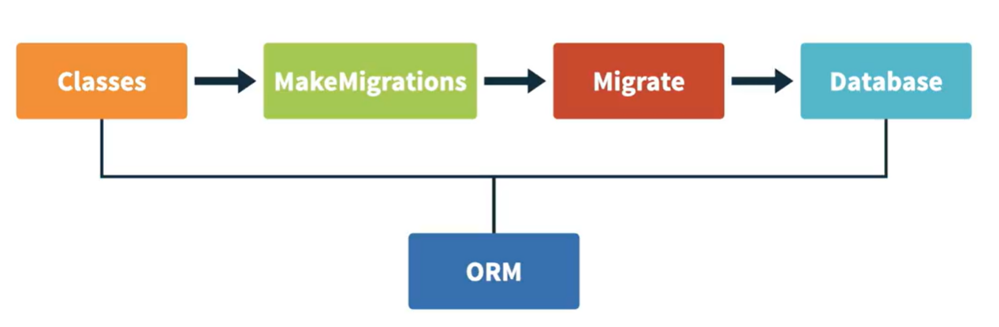

## Database with Django


## Introduction to ORMS
So far, you've gotten familiarized with the user models, which were completely defined by Django. Now, it's time to understand how to create your own models and how the structure of creating models work. Django uses an object-relational mapping system or ORM to handle database communication and changes. 


What you need is to write class models that will then be transformed by migrations into database tables. Each class, known as a model, is a database table, and each class attribute is a column. The way we transform a model into a database table is by the creation of migrations. Migrations will have the step-by-step transformation that a database must do to apply the changes made in the code. You've seen that we use the command Migrate to apply migrations to a database. Similarly, we can use the command MakeMigrations to create migrations based on the current code. The process of using a class, defining a model, creating a migration, and applying the migration and the changes to the database is the ORM's job, and Django's ORM is known for being 
one of the best ORMs for Python and SQL databases.


## Creating your first Model
Learn how to create a new model using Django ORM. 

1. Let's create a new app specifically for our notes. 
```bash
 django-admin startapp notes
```

2. We have to go to the settings and make sure that our new app is added in the INSTALLED_APPS variable.
```py
  # Application definition

INSTALLED_APPS = [
    'django.contrib.admin',
    'django.contrib.auth',
    'django.contrib.contenttypes',
    'django.contrib.sessions',
    'django.contrib.messages',
    'django.contrib.staticfiles',
    # apps
    'board',
    'notes'
] 
```
3. Okay, now we can go back to this new app (`notes`) and open the `models.py` file. Here is the file where we can create the models that we'll use in this app. So let's create a new class called Notes that we'll inherit from models.Model.
```py
   from django.db import models

    # Create your models here.
    class Nodes(models.Model):
        
```

This way, Django knows that this is a model that will have effect on the database, et cetera.

4. It's time for us to think what attributes we want in our note. Well, first we can add a title. A title is a short text, so we can use the type CharField, which is a limited text field. CharField has a parameter called max_length, and we should set it to a value. Let's say 200. This means that our title can't be over 200 characters. We also need the note itself. And the note shouldn't have a limit. So instead of using CharField, we can use the type TextField. As you can see, TextField doesn't require a max length, differently from CharField. We also want to know when this note was created. So we can add a field call created that is going to be a DateTimeField. Because we don't really want to worry about this field being correctly populated, we can add a perimeter called auto_now_add equals to True. This means that every time a note is created, this field will be correctly populated with the time that this note was created. So we don't really have to worry about it. There, our notes model is done. Every note we create will have at least a title, a text, and a date. 
```py
   from django.db import models

    # Create your models here.
    class Nodes(models.Model):
        title = models.ChartField(max_length=200)
        text = models.TexField()
        created = models.DateTimeField(auto_now_add_True)
```
5. Now we need to create migrations.
```bash
   python manage.py makemigrations
``` 
There is a new folder called migrations, and inside of it, there's a new file called 001_intial. Every first migration of an app will be named like this. If you open this, you can see that this is just a list of operations that instructs the database what needs to be done. So far, we haven't changed anything in the database. We just created the set of instructions. So everything continues as it is. 
6. Then we need to apply the migrations so we can run:
```bash
    py manage.py migrate
``` 
The changes were applied to the database and we have a shiny new table.

## Using Adming for data creation and manipulation


## Using Django shell for creating and quering data.